# Space Salvation: Viral Frontier
## Main Idea
The main idea was to create an interesting RPG game, with using all skills which I've got during courses. The game has an exciting plot, and so many interesting systems, like **Quest System**, **Inventory System**, **Dialogues**, **Stat System**, **Skills** and even **Character gender selection** with **Saving System**.

## Plot
Half a century ago, we were compelled to **abandon** our planet due to an imminent *****Catastrophe*****: a **virus** that indiscriminately **destroyed** all life and engendered **mutations** in surviving organisms. Space constraints on the spacecraft led to the **exclusion** of some individuals. Throughout this time, scientists **embarked** on missions to the planet, endeavoring to reestablish life. They devised methods to **combat** the *****virus***** and initiated agricultural efforts. However, a segment of the planet remained **untouched** by these advancements, steadily **deteriorating under the virus's relentless assault**.

The ***Player's*** **goal** in this game is to **discern the forces hindering the rejuvenation of this portion of the planet** and **to trace the origins** of the enigmatic *****"black hole."*****

## About
At the beginning of the game you are given the **choice of gender for your character**. Next, you will complete quests, understanding the plot along the way. The game has **various enemies** in whose path you have to stand, as well as **various combat options**, from primitive **daggers** to **firearms** and **magic**.

## Screenshots
*****BE CAREFUL! SPOILERS IN THE END!*****
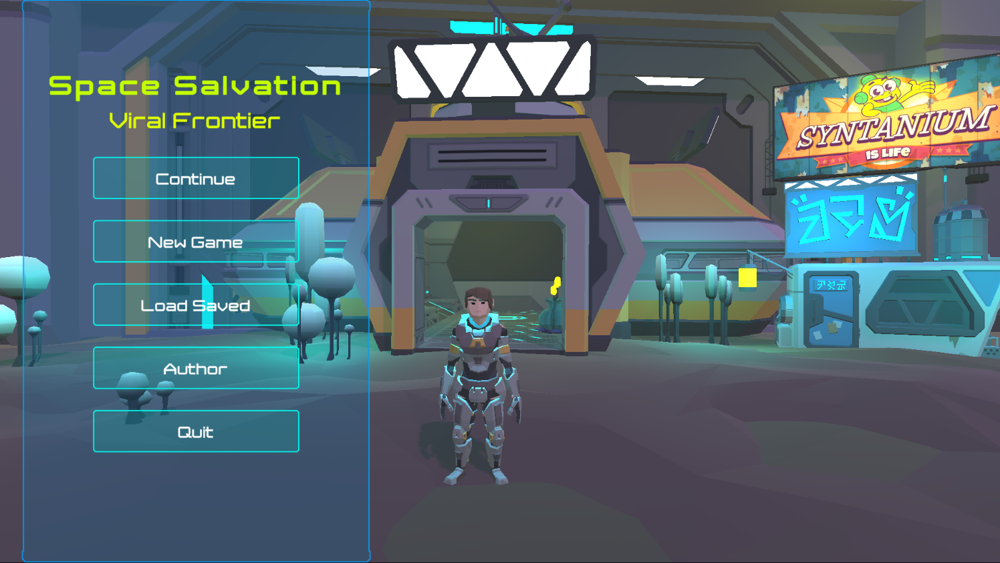 </img>
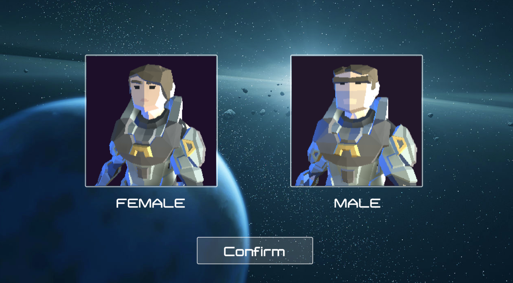 </img>
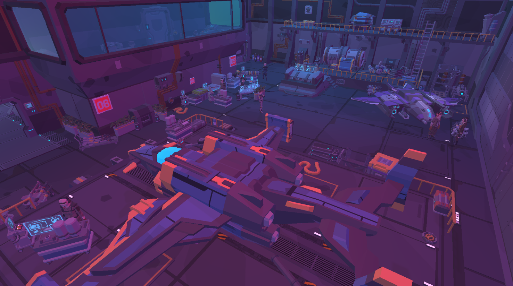 </img>
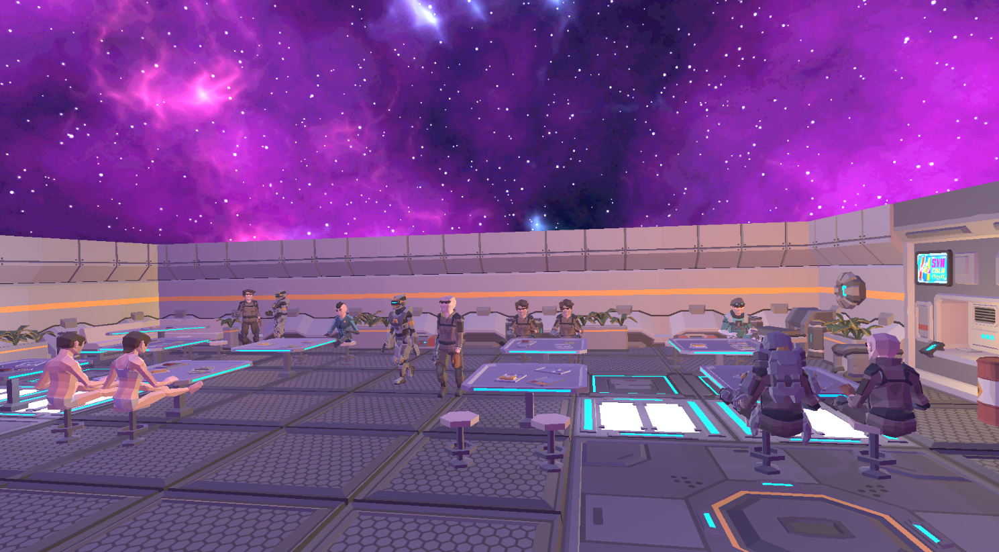 </img>
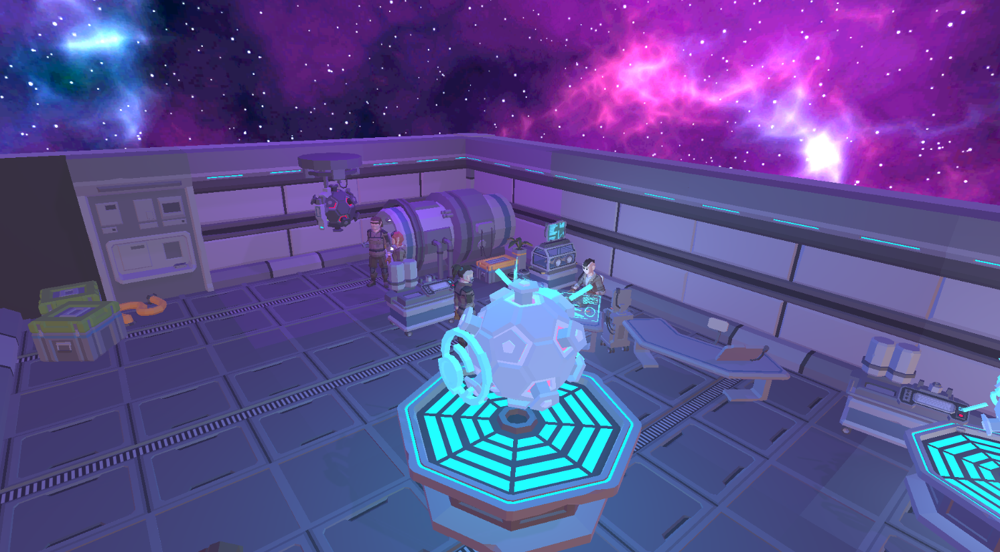 </img>
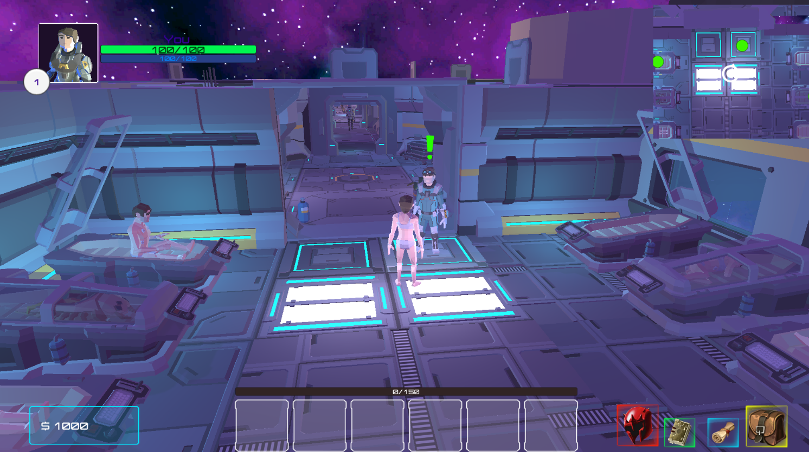 </img>
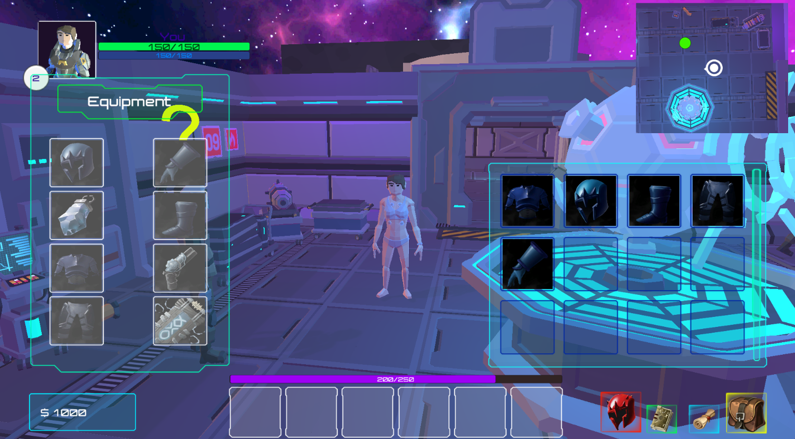 </img>
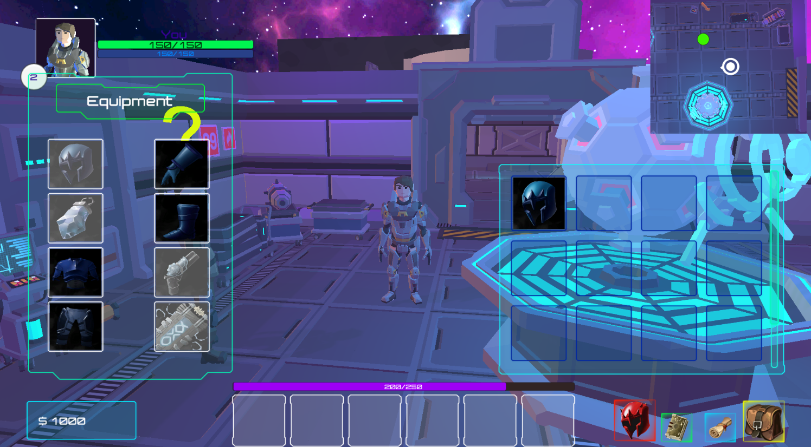 </img>
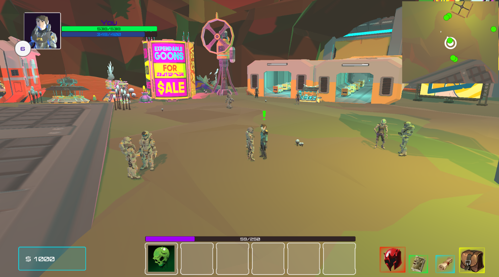 </img>
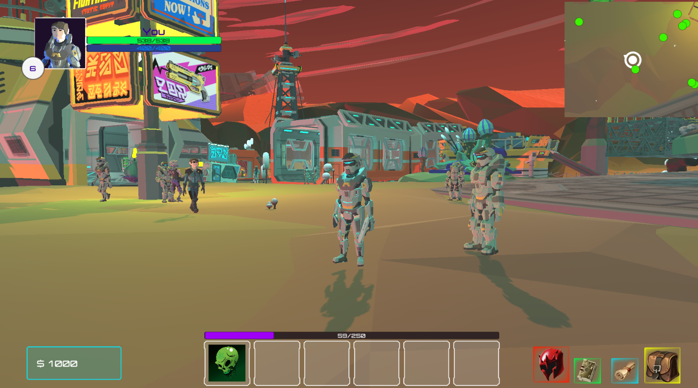 </img>
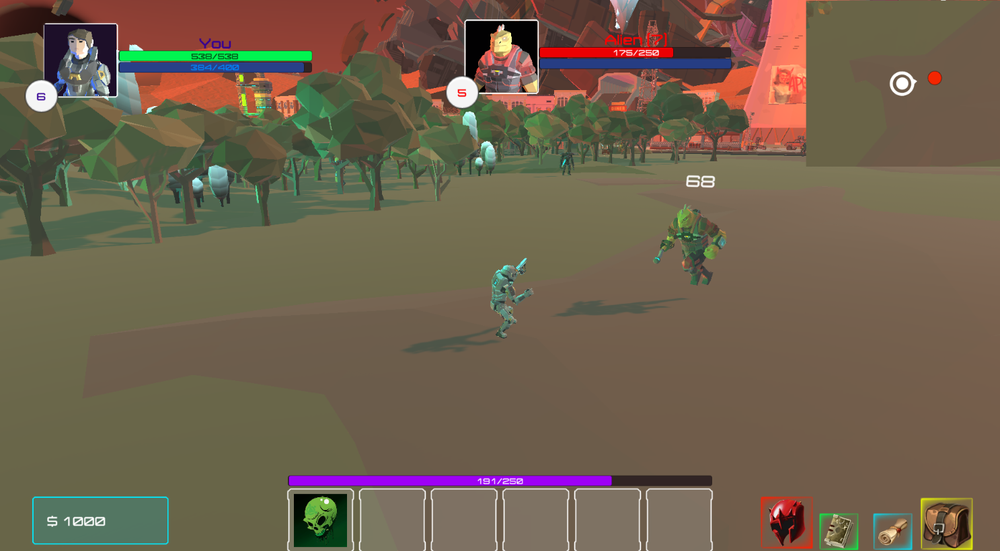 </img>
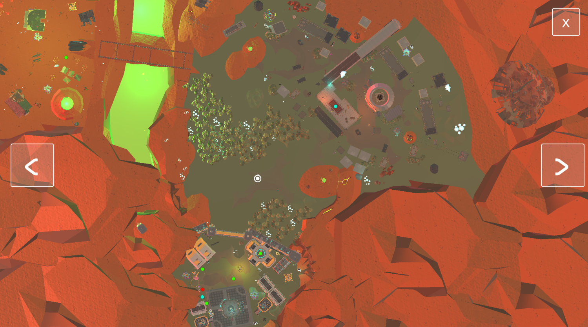 </img>
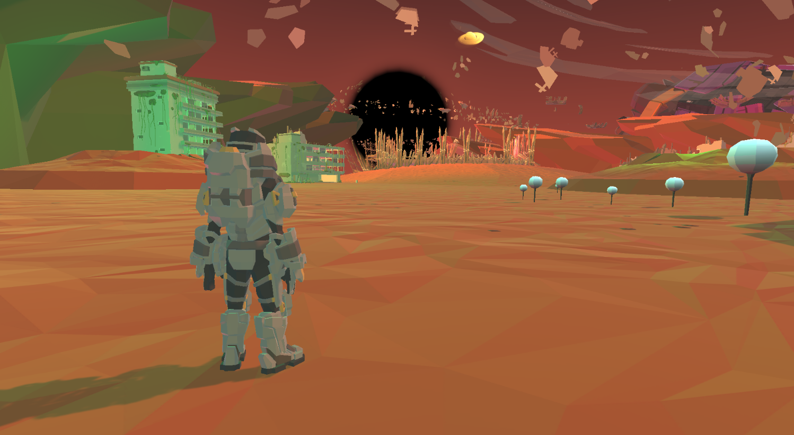 </img>
